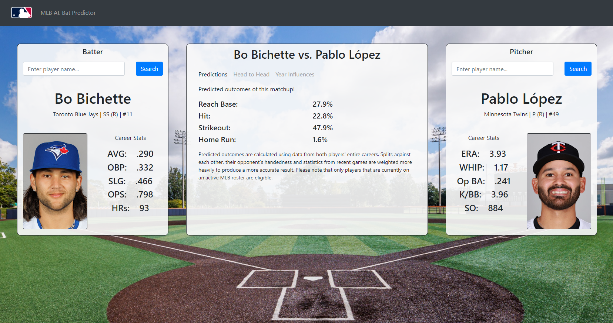

# MLB At-bat Predictor ⚾

Ever wanted to see the probability of your favourite baseball player hitting a home run against a rival pitcher? Or maybe the chance that a closer can shut down the best of the best? If yes, this project is for you! The MLB At-bat Predictor uses a variety of existing statistics and information on two players (a pitcher and a batter) to predict the probabilites of certain outcomes occuring. It also performs inference on the impact that certain years have to these outcomes by calculating the Leave One Out influence of each relevant year. Built using Flask and Boostrap, and MLB-StatsAPI.

Note: This project was created for CMPT 419 at SFU and has focused on performing operations on large sets of data instead of front-end design and user experience. The LOO year influence can take a while to compute, so long loading times can be expected.
